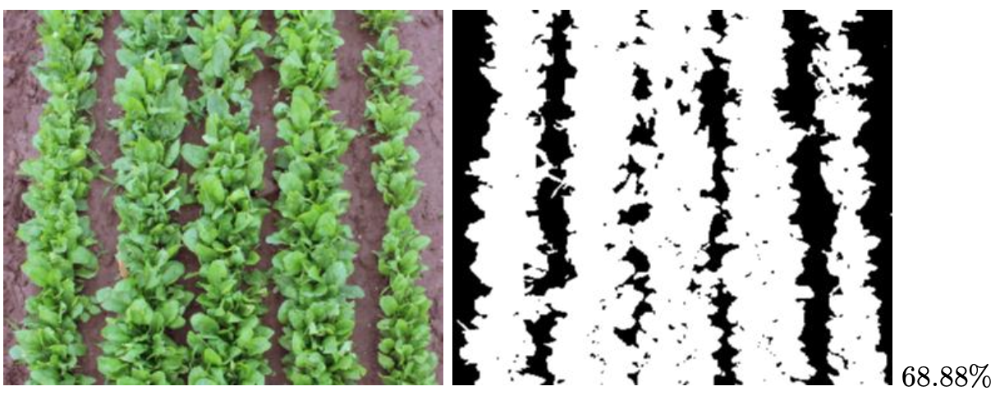

# Bedeckungsgrad

Die Skripte in diesem Projekt dienen dazu, den Bedeckungsgrad auf Grundlage von RGB-Fotos zu berechnen. 

### Berechnung:
Über die Kanal-Berechnung „2*green – red – blue“ wird der Green Excess Index gebildet, welcher in einem Grauwerte-Bild resultiert. Der Grenzwert (grau) zur Unterscheidung zwischen Pflanze (weiß) und Boden (schwarz) wird nach Otsu (1979; vgl. literatur/otsu.pdf) auf Grundlage des Histogramms bestimmt. Abschließend wird das Verhältnis der Anzahl weißer zu schwarzer Pixel berechnet, und als Bedeckungsgrad in Prozent ausgegeben.

### Anwendung:
Die Berechnung wie oben beschrieben erfolgt mit dem Skript analyses/batch.bedeckungsgrad.R. Um einen einfachen Workflow zu gewährleisten, wurde das RMD-file Beispiel_Batch_Berechnung.Rmd erstellt. Dort wird im oberen Teil des Skriptes der Ordner der Input-Bilder angegeben. Anschließend kann das Dokument geknitted werden. 
Die Ausgabe besteht aus 

-	einer CSV-Datei der Bedeckungsgrade
-	den Ausgabe-Bildern (schwarz-weißer Bedeckungsgrad)
-	neu skalierten Input-Bildern
-	sowie dem zugehörigen PDF-Dokument des RMD-Skriptes, welche die Bedeckungsgrad-Bilder gegenüberstellt.

### Hinweise:
Die Order-Struktur des Projektes ist zu beachten:

-	Input-Bilder unter data/input_images/….eigenerOrdner (vom Benutzer zu erstellen)
-	Neu skalierte Input-Bilder unter data/input_images_resized/…eigenerOrdner (automatisch erstellt)
-	Output-Bilder unter data/output_images/…eigenerOrdner (automatisch erstellt)
-	Output-CSV unter data/Bedeckungsgrad_csv/… eigenerOrdner_Bedeckungsgrade.csv (automatisch erstellt)

Das Skript Beispiel_Batch_Berechnung.Rmd sollte vor jeder Durchführung (d.h neuer Ordner mit Bildern) im selben Ordner kopiert und umbenannt werden.

### Beispiel:

