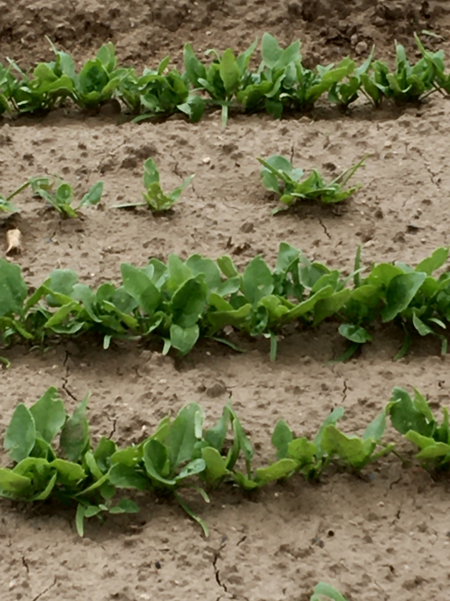

```{r setup, include=FALSE, warning=FALSE, error=FALSE, message=FALSE}
knitr::opts_chunk$set(echo = TRUE)
```





```{r}
library(raster)
library(jpeg)
library(RColorBrewer)
library(ggplot2)
library(dplyr)
library(reshape2)
```

##Bild laden:
```{r}
#img <- readJPEG("../data/F4b_Tag_15.jpeg")
img <- readJPEG("../data/F4a_Tag_25.JPG")

```

#resize image to width = 100 pixels
```{r}
imgDm <- dim(img)
height1 <- 300
width1 <- floor(imgDm[2]/imgDm[1]*height1)
img2 <- OpenImageR::resizeImage(img, width = height1, height = width1, 
                                method = "nearest", 
                                normalize_pixels = TRUE) #sRGB color  #range(img2[,,1])

#Workspace aufräumen:
rm(img)
gc()
```

#Bild plotten:
```{r}
OpenImageR::imageShow(img2) #all channels
OpenImageR::imageShow(img2[,,1]) #red
OpenImageR::imageShow(img2[,,2]) #green
OpenImageR::imageShow(img2[,,3]) #blue
```


#Histogram des Kanäle
```{r}
img_melted <- tidyr::pivot_longer(data.frame(r=as.vector(img2[,,1]), 
                                             g=as.vector(img2[,,2]), 
                                             b=as.vector(img2[,,3])),
                                  cols = everything()) %>%
    mutate_at("name", ~factor(., levels = c("r", "g", "b")))

lattice::histogram(~ value | name,data= img_melted)
```

#Methodik nach Hyun K. Suh et al. (2017)
Precision Agric (2018) 19:218–237

#RGB normalisieren: (entspricht cie xyz color-scale)
```{r}
img3 <- array(dim = c(height1,width1, 3)) #img2

img3[,,1] <- img2[,,1]/(img2[,,1]+img2[,,2]+img2[,,3])
img3[,,2] <- img2[,,2]/(img2[,,1]+img2[,,2]+img2[,,3])
img3[,,3] <- img2[,,3]/(img2[,,1]+img2[,,2]+img2[,,3])

```

#Histogram des Kanäle
```{r}
img_melted_norm <- tidyr::pivot_longer(data.frame(r=as.vector(img3[,,1]), 
                                                  g=as.vector(img3[,,2]), 
                                                  b=as.vector(img3[,,3])),
                                       cols = everything()) %>%
    mutate_at("name", ~factor(., levels = c("r", "g", "b")))

lattice::histogram(~ value | name,data= img_melted_norm)
```

##Alle genormten Kanäle plotten
```{r}
#OpenImageR::imageShow(img3) #all channels
OpenImageR::imageShow(img3[,,1]) #red
OpenImageR::imageShow(img3[,,2]) #green
OpenImageR::imageShow(img3[,,3]) #blue
```


##Step a: excess green (ExG)
```{r}
#excess green index (ExG = 2 g - r-b)
ExG <- 2*img2[,,2] - img2[,,1] - img2[,,3] #von sRGB, nicht von Normalisiertem Bild!

OpenImageR::imageShow(ExG) #Exg

```


Histogram ExG
```{r}
t1 <- 0.2 #0.3 #threshold according to histogram
hist(ExG, breaks = 30)
abline(v=t1, col ="red")
```

##Step b+c: Otsu threshold: in 0 und 1 umwandeln (planze/keine pflanze)
```{r}
ExG_Otsu <- ifelse(ExG < t1,0,255) #t1 wir oben im Histogram definiert
OpenImageR::imageShow(ExG) #Exg
OpenImageR::imageShow(ExG_Otsu) #ExG_Otsu


# img_final <- array(dim = c(width1,height1,2)) #img2
# img_final[,,1] <- ExG
# img_final[,,2] <- ExG_Otsu
```


#Optional: Ground shadow berechnen:
```{r}
CGS <- (img2[,,1] * img2[,,2]) / img2[,,3]

CGS[is.na(CGS)] <- 0
OpenImageR::imageShow(CGS)


t1 <- 3 #threshold for shadow:
hist(CGS, breaks = 30)
abline(v=t1, col ="red")


CGS01 <- ifelse(CGS < t1,0,100) #t1 wir oben im Histogram definiert

OpenImageR::imageShow(CGS01)

```
ExG_Otsu: Schatten hinzufügen.
```{r}
ExG_Otsu[CGS01==100] <- 100
OpenImageR::imageShow(ExG_Otsu)
```


Bedeckungsgrad berechnen:
```{r}
Bedeckungsgrad_table <- table(ExG_Otsu)
#0 == Boden
#100 == Schatten
#255 == Pflanze (Licht)

probs <- prop.table(Bedeckungsgrad_table) *100 
cat("Bedeckungsgrad: ", round(probs[[ "255"]],2), "%")

```


##save shadow-plant-image
```{r, message=FALSE}
#writeJPEG(image = z8, target = "Schatten.jpeg")

jpeg(filename = "../figures/Spinatbild_final2.jpeg", width = width1, height = height1)
OpenImageR::imageShow(ExG_Otsu) #ExG_Otsu
dev.off()


# jpeg(filename = "../figures/Spinatbild_final1.jpeg", width = width1, height = height1)
# OpenImageR::imageShow(img2) #ExG_Otsu
# dev.off()
