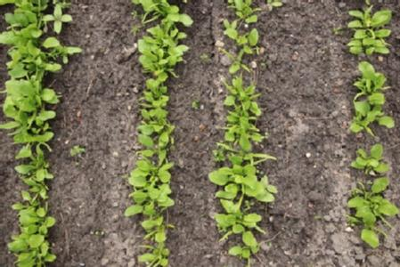
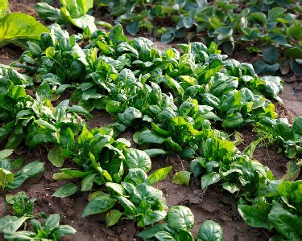
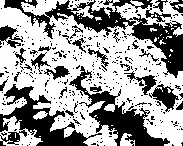
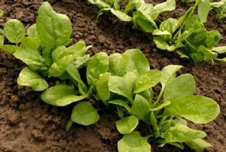
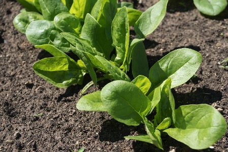
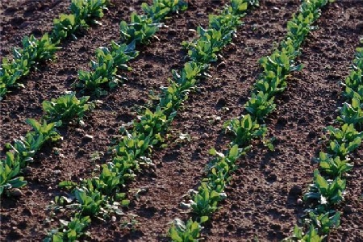
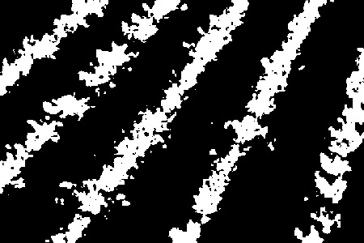
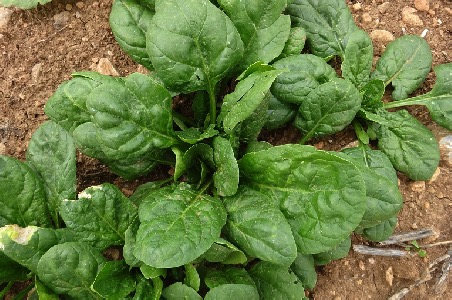
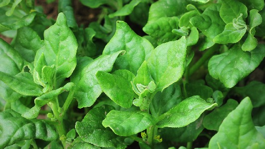
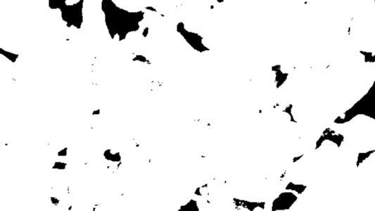

```{r}
library(dplyr)
library(purrr)
```

```{r}
source("batch_bedeckungsgrad.R")
```

```{r}
file_list <- list.files(path = "../data/", pattern = "jpg")
file_list
```
# Anwendung fuer eine einzelnes Bild:
```{r}
a <- batch_bedeckungsgrad(image_in_path = "../data/",
                          image_in_file = "F4a_Tag_25.JPG", 
                          image_out_path = "../figures/Spinat_2020/",
                          image_out_file = "Bedeckungsgrad1.jpeg")
```

# Anwendung fuer ganzen Ordner:
```{r}
alle_bedeckungsgrade <- 
    map_df(file_list,
           ~batch_bedeckungsgrad(image_in_path = "../data/",
                                 image_in_file = .x, 
                                 image_out_path = "../figures/Spinat_2020/",
                                 image_out_file = .x)
    )
```
```{r}
alle_bedeckungsgrade
```
```{r }
"../figures/Spinat_2020/Spinat1.jpg_input_resized.jpeg"
```

  

   

   

   

   

   

   


# Tst2
```{r echo=FALSE,out.width="49%", out.height="20%",fig.cap="caption",fig.show='hold',fig.align='center'}

knitr::include_graphics(c(paste0("../figures/Spinat_2020/", file_list[1:2])))

```

